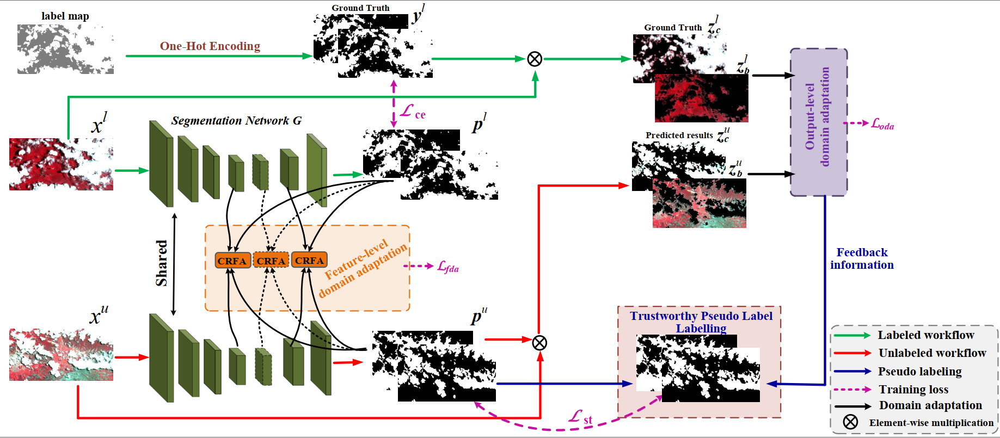

# Semi-supervised Cloud Detection (SSCDnet) in Satellite Images by Considering Domain Shift Problem

This Pytorch repository contains the code for our work [Semi-supervised Cloud Detection in Satellite Images by
Considering Domain Shift Problem]. 
 For semi-supervised cloud detection, we take domain shift problem into account the semi-supervised learning (SSL) network. Feature-level and output-level domain adaptations are applied to reduce the domain distribution gaps between labeled and unlabeled images, thus improving predicted results accuracy of the SSL network.
Experimental results on Landsat-8 OLI (https://landsat.usgs.gov/landsat-8-cloud-cover-assessment-validation-data) and GF-1 WFV (http://sendimage.whu.edu.cn/en/mfc-validation-data/) multispectral images demonstrate that the proposed semi-supervised cloud detection network (SSCDnet) is able to achieve promising cloud detection performance when using a limited number of labeled samples and outperforms several state-of-the-art SSL methods


## Package pre-requisites
The code runs on Python 3 and Pytorch 0.4 The following packages are required. 

```
pip install scipy tqdm matplotlib numpy opencv-python
```

## Dataset preparation

Download ImageNet pretrained Resnet-101([Link](https://download.pytorch.org/models/resnet101-5d3b4d8f.pth)) and place it ```./pretrained_models/```


## Training and Validation

### Training and Validation 
```
python train_SSCDnet.py   python evaluate.py 
```


## Instructions for setting-up Multi-Label Mean-Teacher branch
This work is based on the [Semi-supervised Semantic Segmentation with High- and Low-level Consistency](https://arxiv.org/pdf/1908.05724.pdf).
code available:
https://github.com/sud0301/semisup-semseg

## Acknowledgement

Parts of the code have been adapted from: 
[DeepLab-Resnet-Pytorch](https://github.com/speedinghzl/Pytorch-Deeplab), [AdvSemiSeg](https://github.com/hfslyc/AdvSemiSeg), [PyTorch-Encoding](https://github.com/zhanghang1989/PyTorch-Encoding)
[mean-teacher](https://github.com/CuriousAI/mean-teacher) 

## Citation
A sumitted paper of Remote sensing


@article{
    guo2022SSCDnet,
    Author = {Jianhua Guo and Qingsong Xu and Yue Zeng and Zhiheng Liu and Xiao Xiang Zhu},
    Title = {Semi-Supervised Cloud Detection in Satellite Images by Considering Domain Shift Proble.},
    journal = {Remote Sens},
    Year = {2022},
}

